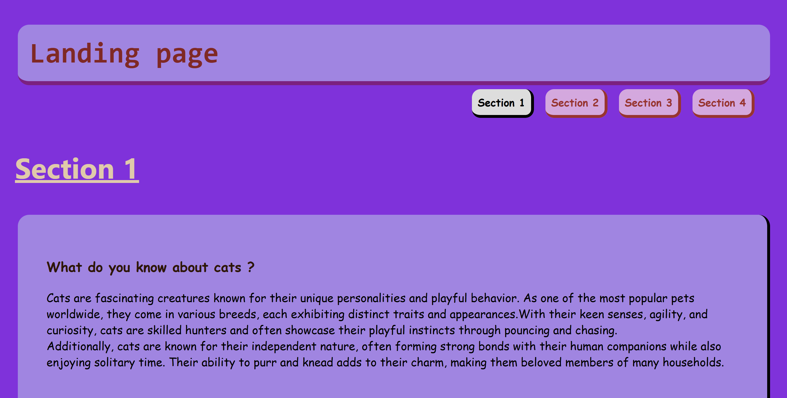

(Landing page)
is a project that contain a several sections , the sections contain a brief paragraph about certain topics.
it's also have a navigation bar of these sections ,
you can use the list on the nav bar to check each section by clicking the items you want to view.

the index page contain a header, main and footer parts
in the header we have a title: 

# Landing page

and navigation bar :
- Section 1
- Section 2
- Section 3
- Section 4

in the main part we have the different sections..

the first one have a title:

# Section 1

and another title with medium font:

# What do you know about cats ?

and a paragraph :

Cats are fascinating creatures known for their unique personalities and playful behavior.
As one of the most popular pets worldwide, they come in various breeds, each exhibiting distinct
traits and appearances.With their keen senses, agility, and curiosity,
cats are skilled hunters and often showcase their playful instincts through pouncing and
chasing.

Additionally, cats are known for their independent nature, often forming strong bonds with their
human companions while also enjoying solitary time. Their ability to purr and knead adds to
their charm, making them beloved members of many households.

the Second one have a title:

# Section 2

and another title with medium font:

# Do you love cooking..?

and a paragraph :

one of my favorite hobbies is cooking! i love to learn everything about cooking food ,
the different taste, and any new ingredients that add
the next flavor to my wonderful cooking world.

Another reason why I love cooking is the feeling of satisfaction when someone tastes something I
prepared myself and seeing their reaction to it, whether their reaction is good or bad.
I love learning and I love to challenge myself. However, I am most happy when they like my food.

the third one have a title:

# Section 3

and another title with medium font:

# How about traveling !

and a paragraph :

Anything about discover and explore new places in the world is somthing thats always capture
my interest. I love traveling around the world, visiting new countries , and learn more about
different cultures and viewing the beautiful places of it.

Salalah is one of the most wonderful places in the Sultanate of Oman. I have visited it more
than once. Salalah is distinguished by its green surfaces, clear fresh water, and light drizzle,
which adds a pleasant and refreshing atmosphere for tourism.
In the future, I would love to travel outside of Oman to discover different countries,
such as: Japan, China, Korea, Ireland... and other countries.
In fact, this was one of my dreams since childhood ,is to travel around the world and explore
itsfeatures.

the forth one have a title:

# Section 4

and another title with medium font:

# Art is another form of beautiful life !

and a paragraph :

Another excited hobby of mine is drawing! it's just a wonderful way to share my feeling to
the world. something i'm not quite good at it, but really loving it.
I have this hobby since i was little, the structures, shapes and colors have been always captured
my interest, love to interact with it and tray to add my special flavor to it.

also i do admire the artist that can affect my feeling by its art,
that's for me is a powerful achievement , and make me want to achieve their levels, and learn
more about arts.

at the end we have the footer..

in the footer we have 2 parts, the first one contain an image as a simple logo

under the image we have a medium title:

## Copyright 2024

the second part we have 3 cards, each card contain some details ..
first card :

### Home

### Apout Us

### Contact Us

second card:

### Follow Us

### Instgram

### Facebook

third card:

### Landing Page

### Galary

### Copyright 2024